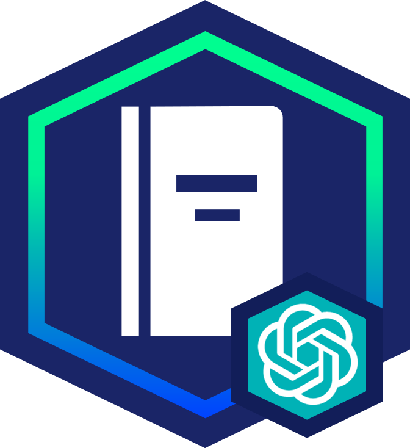
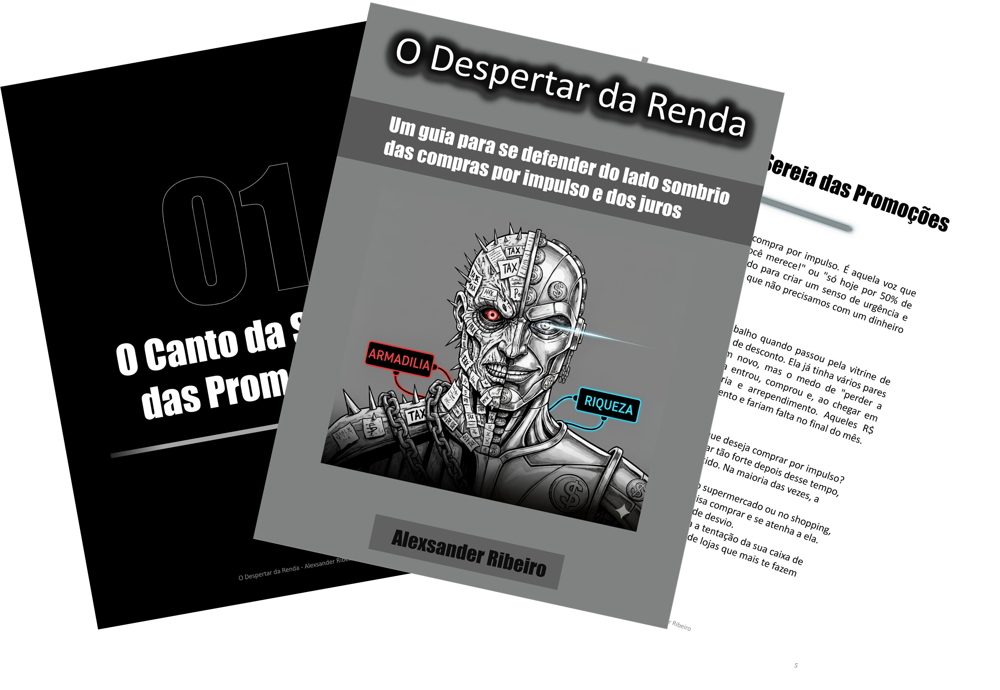

    

-------

# Projeto EBOOK Gerado por I.A.s

 > ℹ️ **NOTE:** Este é o repositório desenvolvido durante o curso no qual fui aluno na plataforma da [DIO](https://dio.me)

Projeto com o objetivo de gerar um ebook digital com as facilidades das ferramentas de IA. todos os prompts
seguem abaixo.

<a href="https://github.com/Sander0026/prompts-recipe-to-create-a-ebook_/blob/main/output/ebook%20-%20O%20Despertar%20da%20Renda.pdf" title="View PDF now"> 📕Clique aqui para ler</a>

## 💻 Tecnologias utilizadas no projeto

- [ChatGPT](https://chat.openai.com/) 
- [MidJourney](https://www.midjourney.com/app/)
- [PowerPoint](https://www.microsoft.com/en/microsoft-365/powerpoint)

## 🧠 Prompts

ChatGPT：

| **Ação**  | **Prompt**                                                                                  |
|-----------|---------------------------------------------------------------------------------------------|
| título    | Crie um título e um subtítulo de um ebook sobre o tema de Controle financeiro. O ebook é do nicho financeiro e o subnicho é de Gastos pessoais. O título deve ser épico, curto, com temática de Star Wars, e apresente 5 variações de títulos. |
| conteúdo  | Faça um texto para ebook, com foco em Controle Financeiro, listando as principais causas dos gastos pessoais com exemplos de como resolver. Regras: Explique de forma simples; deixe o texto enxuto; traga exemplos em contextos reais; utilize título sugestivo por tópico. |

### MidJourney

| **Ação** | **Prompt**                                                                                                                    |
|----------|-------------------------------------------------------------------------------------------------------------------------------|
| título   | Create a character with a face divided in half between money and debt, in a contrast between having money and being in debt, animation style, black and white style, neutral background, professional tone, book cover, high resolution, downward angle --ar 1:1 --v 5.2 |

## ✨ Features

- Conteúdo gerado via ChatGPT
- Imagens geradas via MidJourney

## 📚 Materiais

- Imagens utilizadas em `assets`
- ebook gerado durante as aulas em `output`

## 🛠️ Instruções de execução

Utilize os prompts acima nas ferramentas sugeridas para gerar o material base e utilize uma ferramenta de edição de documentos como power point, libreoffice , indesign para diagramação.

